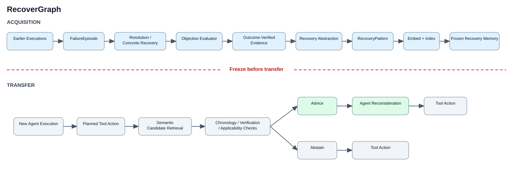

# RecoverGraph

**Outcome-Verified Recovery Experience for LLM Coding Agents**

RecoverGraph is a research prototype that represents verified software repair experience as recovery patterns and retrieves applicable patterns for later coding-agent work. Its implementation is distributed as the Python package `graph_swarm`.

The reported evaluation compares a no-advice baseline (B0) with a retrieval treatment (T) across four frozen repository tasks. B0 and T use the same pinned tasks, Qwen coding model, prompt, controlled tools, evaluator, and Docker/network policy. The retained outputs support offline integrity checks and descriptive analyses; all reported runs are classified `VALID_DEVELOPMENT`.

## Architecture



The figure is generated by `experiments/analysis/generate_figure1.py`.

## Key research findings

For EXP1–EXP3, recurrence was observed in 2/3 B0 runs (66.7%) and 1/3 T runs (33.3%), a descriptive difference of 33.3 percentage points. Task success was 2/3 in both conditions. This small development sample does not support inferential statistical claims or a causal claim that advice caused EXP1's repair.

EXP1 is the positive treatment case. EXP2 is a no-advice recurrence case, not selective abstention. EXP3 is a retrieval/timing case. EXP4 adds another retrieval/timing case. FAR is not computable from the retained artifacts.

## Repository structure

- `src/graph_swarm/` — implementation
- `benchmark/` — frozen task definitions and reported-case manifest
- `configs/` — model and experiment configurations, including reported snapshots
- `experiments/` — public stored-evaluation runner and analysis generators
- `research/` — methodology, results, reproducibility notes, figures, and canonical evidence
- `tests/` — unit and integration tests
- `paper/` — manuscript release location

## Installation

Use Python 3.12 or 3.13:

```powershell
python -m pip install -e ".[dev]"
```

Docker and provider credentials are not needed for offline validation and result generation.

## Validate stored evaluation

```powershell
python experiments/run_reported_evaluation.py --list
python experiments/run_reported_evaluation.py --case EXP1 --condition B0 --validate-only
python -m pytest tests/unit/memory/test_recovery_embeddings.py tests/unit/research/test_reported_evaluation_package.py tests/unit/research/test_reproducibility_layer.py
```

These checks read the frozen evidence package. They do not call a provider.

## Regenerate results

```powershell
python experiments/analysis/generate_results.py --output-dir experiments/analysis/generated
```

The output contains descriptive recurrence and task-success summaries. Regeneration does not execute agents or call providers.

## Regenerate Figure 1

```powershell
python experiments/analysis/generate_figure1.py --output research/figures/figure1_recovergraph.svg
```

## Prepare benchmark repositories

Preparation clones a selected repository and checks out its pinned revision. It requires Git and network access:

```powershell
python experiments/run_reported_evaluation.py --case EXP1 --prepare-only
```

Replace `EXP1` with `EXP2`, `EXP3`, or `EXP4` to prepare another case. Existing preparation directories are never replaced.

## Run evaluation / execution status

The public runner supports `--list`, `--validate-only`, `--dry-run`, and `--prepare-only`. It has no `--execute` mode. The existing verified execution primitive is an all-case T006–T008 batch tied to its frozen runtime contract; it does not provide a parity-checked single-case adapter for all four reported cases, including the separate EXP4 runtime. Therefore this release does not expose execution through the public runner. Default and validation invocations never initialize a provider.

## Reported cases

| Paper case | Canonical task | Description |
|---|---|---|
| EXP1 | GS-T006 | Positive treatment case |
| EXP2 | GS-T007 | No-advice recurrence case |
| EXP3 | GS-T008 | Retrieval/timing case |
| EXP4 | GS-T017 | Additional retrieval/timing case |

The canonical evidence copies and recurrence adjudications are under `research/evidence/reported/`. Their manifests retain run IDs, execution commits, config provenance, and SHA-256 hashes.

## Reproducibility

See [research/REPRODUCIBILITY.md](research/REPRODUCIBILITY.md) for environment details, exact repository revisions, offline commands, and known evidence gaps. Acquisition provenance for the frozen five-pattern corpus is packaged at `research/evidence/reported/frozen_memory/provenance/`.

## Limitations

- The reported cases are a small development evaluation, not confirmatory evidence.
- FAR cannot be computed from retained artifacts.
- The frozen memory export has three full records and two partial records; unavailable fields remain null.
- Historical image digests are incomplete, and reproducing agent runs requires Docker, external repositories/images, and Kilo access.
- The public runner does not execute experiments.

## Citation

See [CITATION.cff](CITATION.cff) for the repository/software citation. The paper PDF has not yet been added.

## License

RecoverGraph is licensed under the [Apache License 2.0](LICENSE).
Third-party components and materials remain under their respective licenses and terms;
this project license does not relicense or grant rights to them. This includes, where
applicable, SWE-smith benchmark data, other external datasets, task patches, and benchmark environments; upstream
projects such as Tornado, Jinja, SQLGlot, and Rich; Python dependencies such as Neo4j,
PydanticAI, and other dependencies; and external Qwen and Cohere models and services.
Consult each upstream project's license and each service's terms for use or redistribution.
See [NOTICE](NOTICE) for identified source excerpts and benchmark attribution details.
